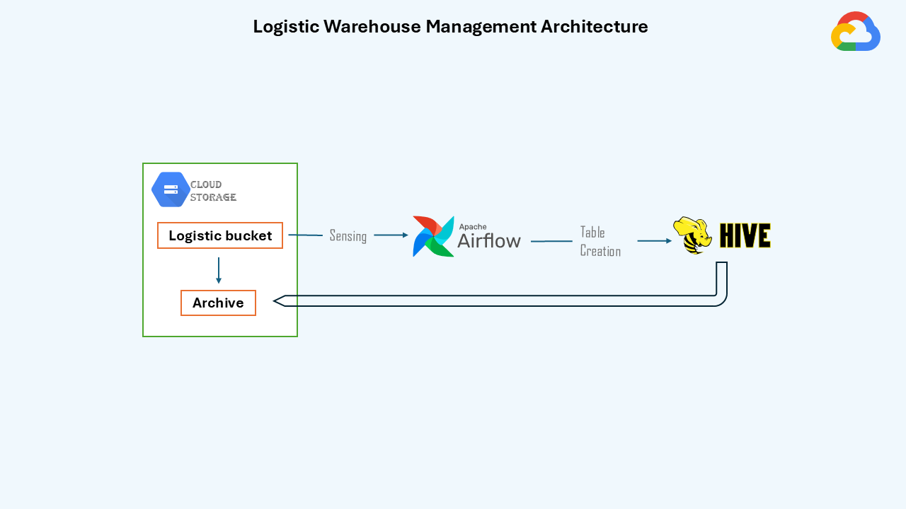

# GCP-Logistics-Data-Warehouse-Management

This project automates the management of logistics data stored in Google Cloud Storage (GCS) by leveraging Apache Airflow on **GCP Cloud Composer** and **GCP Dataproc**. The Airflow DAG senses new logistics files uploaded to a GCS directory and processes them by creating a Hive database, setting up external and partitioned tables in Hive, and loading the data into partitioned tables for further analysis. After processing, the data is archived into a separate GCS bucket for long-term storage.

Key functionalities include:
- Creating a Hive database and external tables in GCP Dataproc.
- Partitioning tables for efficient data storage and retrieval.
- Archiving processed data to another cloud storage bucket after loading.
- Scheduling the process to run daily using Airflow (on GCP Cloud Composer).

The project leverages the scalability of **GCP** and **Dataproc** for big data processing and the simplicity of **Airflow** for orchestrating the ETL pipeline.

## Table of Contents
- [Introduction](#gcp-logistics-data-warehouse-management)
- [Architecture](#architecture)
- [Dependencies/Requirements](#dependenciesrequirements)
- [Tech Stack](#tech-stack)
- [Implementation Process](#implementation-process)
- [Resources](#resources)

## Architecture

The project leverages Google Cloud Platform services such as GCS for raw data storage, Dataproc for Hive job execution, and Cloud Composer for orchestrating the ETL workflow to process and store logistics data in Hive.

## Dependencies/Requirements
To execute or run this project, you need the following:

### Prerequisites:
1. **GCP Account**: The project uses Google Cloud services like GCS, Dataproc, and Cloud Composer, so you must have a GCP account set up.
2. **Cloud Composer Environment**: This project runs the Airflow DAG in **GCP Cloud Composer**, so you need an active Cloud Composer environment configured. 
3. **GCS Buckets**: Create the following Google Cloud Storage buckets:
   - `logistic_raw` (for raw data files)
   - `logistic_archive` (for archived data)
4. **Dataproc Cluster**: A GCP Dataproc cluster must be set up to execute Hive jobs.

### To run the project:
1. Clone this repository to your local machine.
2. Upload the DAG Python file (`airflow_data.py`) to your GCP Cloud Composer environment's **DAG folder**.
3. Set up the necessary permissions for Cloud Composer to interact with **GCS** and **Dataproc**.
4. Once the environment is ready, the Airflow scheduler in Cloud Composer will automatically run the DAG on a daily schedule.

---

## Tech Stack

The project utilizes the following technologies:

- **Google Cloud Platform (GCP)**: Provides cloud infrastructure and services, including Cloud Storage, Dataproc, and Cloud Composer.
- **Apache Hive**: A data warehouse system used for managing and querying the logistics data.
- **Apache Airflow**: Used for orchestrating the ETL workflow, running Hive jobs, and managing the DAG tasks.
- **Python**: The primary language used for writing the Airflow DAG and interacting with GCP services.

---

## Implementation Process

### Airflow DAG Script

The Airflow DAG Python file is responsible for orchestrating the entire ETL pipeline and can be found in the project repository. This file includes all the tasks such as file detection in GCS, Hive database and table creation, data loading, and file archiving.
You can find the complete Python DAG script for this project [here](link_to_your_python_file).

The project leverages Apache Airflow for orchestrating the ETL pipeline in the following detailed steps:

1. **File Sensing in GCS**:
   - The Airflow DAG begins by using the `GCSObjectsWithPrefixExistenceSensor` to sense the presence of new logistics data files in the specified directory of Google Cloud Storage (GCS) (`logistic_raw/input_data/`).
   - The sensor checks for files with the prefix `logistics_`, and once a new file is detected, it triggers the next steps in the DAG.

2. **Hive Database Creation**:
   - The next task uses the `DataprocSubmitHiveJobOperator` to create a new Hive database called `logistics_db`, if it does not already exist. 
   - This ensures that there is a dedicated database for managing logistics data in Hive, facilitating structured data storage.

3. **Creating an External Hive Table**:
   - Once the database is created (or confirmed to exist), the DAG submits a Hive job to create an external table within `logistics_db`.
   - This table, `logistics_data`, is structured with the necessary columns like `delivery_id`, `date`, `origin`, `destination`, `vehicle_type`, `delivery_status`, and `delivery_time`, with a CSV format.
   - The table points to the location of raw data in GCS (`gs://logistic_raw/input_data/`), using the `FIELDS TERMINATED BY ','` format and skips the header row.

4. **Creating a Partitioned Hive Table**:
   - After the external table is created, the DAG creates a partitioned Hive table, `logistics_data_partitioned`.
   - This table is partitioned by the `date` field, enabling optimized querying and efficient data management for large datasets.
   - This allows for better performance when loading and querying partitioned data, especially when dealing with large volumes of daily logistics data.

5. **Setting Hive Properties for Dynamic Partitioning and Data Loading**:
   - The DAG proceeds to configure Hive properties for dynamic partitioning. This is achieved by setting `hive.exec.dynamic.partition` and `hive.exec.dynamic.partition.mode` to `true` and `nonstrict`, respectively.
   - Then, a `INSERT INTO` statement loads the data from the `logistics_data` external table into the `logistics_data_partitioned` table. 
   - The data is partitioned by the `date` field, ensuring that it is organized by delivery date in the partitioned table.

6. **Archiving Processed Files**:
   - After the data is successfully loaded into the partitioned Hive table, the DAG moves the processed data files from the main `logistic_raw` GCS bucket to the `logistic_archive` bucket.
   - This step uses a `BashOperator` to execute a `gsutil` command that moves all processed CSV files to the archive bucket, ensuring they are stored for future reference or auditing purposes.

7. **Regular Scheduling**:
   - The entire process is scheduled to run daily by Airflow, ensuring that any new logistics data uploaded to GCS is processed automatically on a regular basis.
   - Airflow handles the orchestration, monitoring, and execution of each task, from sensing the new files to archiving them post-processing.

This automation ensures that as soon as new data is available in the GCS bucket, the Airflow DAG kicks off automatically, processes the data, and completes the ETL steps without requiring manual initiation.

---

## Resources

- **Dataset**: Simulated real-world logistic data was used to emulate logistic data ingestion. Access the dataset here: [Logistic-Daily-Data](logistic_daily_data).  
- **Airflow DAG**: The Airflow DAG Python script, used to create and manage the DAG in GCP Composer, is available here: [airflow-dag.py](airflow-dag.py).

